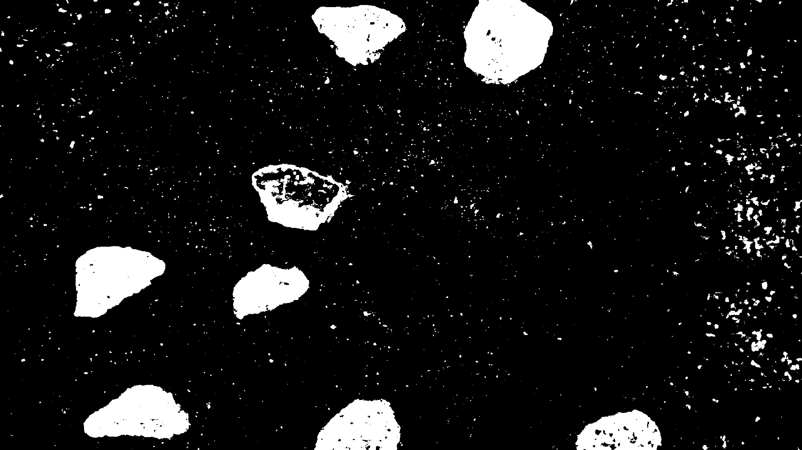

# 3rd Semester Project: Computer Vision for Rock Detection and Robotic Grasping on Mars
## ROB3 Group 367
### Members:
- Benjamin B. Jørgensen
- Minik Heilmann
- Morten Sørensen
- Nicklas A. Deding
- Pierre E. Mortensen

### Maintainer(s):
- Pierre E. Mortensen


Here is what you need to do in order to run the system on a UR5 robotic manipulator equipped with an Intel RealSense D435 camera. It is assumed that ROS Noetic is installed.

## PC Setup
On your PC setup your wired connection as a static IP.

## UR ROS Driver Installation
The UR5 must be able to communicate with ROS, so a UR ROS driver must be installed according to: https://github.com/UniversalRobots/Universal_Robots_ROS_Driver/tree/master

```sh
sudo apt install ros-noetic-ur-robot-driver
```

We recommend installing it from source though into your catkin src folder, please refer to the link for this guide. This will make it a lot easier to modify the yaml files for the UR robot, like joint limits, which you will need to modify, or copy ours, as described later on in this README, to make the robot function more reliable.

Then go to the workspace home folder, and build.

```sh
catkin_make
```

## Preparing the UR5 Robot
Now the robot itself must be prepared, for this a URCap must be installed on the UR pendant. The newest version of the URCap can be found here: https://github.com/UniversalRobots/Universal_Robots_ExternalControl_URCap/releases

Then the URCap must be installed on the robot according to: https://github.com/UniversalRobots/Universal_Robots_ROS_Driver/blob/master/ur_robot_driver/doc/install_urcap_cb3.md

Copy the URCap file onto a USB drive and insert it into the UR pendant. From the welcome screen on the pendant navigate to: Setup Robot -> URCaps. Here click on the plus sign, select the URCap from the USB drive and click open. Restart the robot when promted to.

After the reboot 'External Control' should be visible inside the installation section, once you have pressed 'Program robot' from the welcome screen. 

Select 'External Control' and enter the IP of the PC that will run the ROS driver. Leave the custom port as is.

Now to enable the robot to be controlled by the ROS driver, create a program, and insert the ExternalControl node into the programming tree.

## Calibration of UR Manipulator
Each UR manipulator is calibrated form the factory given precise forward and inverse kinematics. This can be utilized by ROS, by extrating this calibration from the robot. This is highly recommended to do, as the end effectors position could be off by centimeters.
To do so:

```sh
roslaunch ur_calibration calibration_correction.launch \
  robot_ip:=<robot_ip> target_filename:="${HOME}/my_robot_calibration.yaml"
```

Insert the robots ip adress, and a full path to where you want the calibrations to be stored.

## Installing MoveIt
Now you should install MoveIt, which handles the motion planning of the manipulator.

This is done according to the installation guide: https://ros-planning.github.io/moveit_tutorials/doc/getting_started/getting_started.html

Start by installing wstool

```sh
sudo apt install python3-wstool
```

Then install MoveIt

```sh
wstool init .
```

```sh
wstool merge -t . https://raw.githubusercontent.com/ros-planning/moveit/master/moveit.rosinstall
```

```sh
wstool remove moveit_tutorials  # this is cloned in the next section
```

```sh
wstool update -t .
```

The tutorials are removed, since in the guide they recommend cloning this into the workspace.
This is not necessary for this project, but it is included in this packages folder.
If you do desire the tutorials can be cloned into the workspace like so.
First navigate to the src folder of your workspace then:

```sh
git clone https://github.com/ros-planning/moveit_tutorials.git -b master
```

```sh
git clone https://github.com/ros-planning/panda_moveit_config.git -b noetic-devel
```

If there are dependencies not yet installed ROS can install them by:

```sh
rosdep install -y --from-paths . --ignore-src --rosdistro noetic
```

Then go to the workspace home folder, and build.

```sh
catkin_make
```

## Workspace Setup
Get the packages for this project by cloning the rep. onto your PC, this makes copying the packages easier.

```sh
git clone https://github.com/BurningSegway/P3-Project-Group.git
```

Now from the 'packages' folder copy the following packages into your workspace src folder: realsense_ting_controller, ur5_module and wsg_gripper.

You can also copy the joint_limits_corrected.yaml this will be used to limit the manipulators joints, as to avoid solutions to the motion planning that would cause the manipulator to do a configuration change. In your workspace src folder navigate to: universal_robot -> ur_description -> config -> ur5 in here, replace the joint_limits.yaml, with the one you copied, and rename it to joint_limits.yaml

Then go to the workspace home folder, and build.

```sh
catkin_make
```

## Intel Realsense Camera Setup
To get the Intel Realsense camera up and running, install the realsense package according to: https://github.com/IntelRealSense/realsense-ros/tree/ros1-legacy

```sh
sudo apt-get install ros-$ROS_DISTRO-realsense2-camera
```

That should be it, to test out the camera, launch it:

```sh
roslaunch realsense2_camera rs_camera.launch
```

An easy way of seeing if the camera is publishing images, is to launch RViz, and add a view from topic, and selcet color image raw topic.

## Eye-in-Hand Calibration
The last thing that should be done, is to do a eye-in-hand calibration. Since there could be a difference in the setup used in this project, and yours setup. For this purpose MovieIt has a calibration package, that provides a graphical interface for this in RViz. To install the package according to: https://ros-planning.github.io/moveit_tutorials/doc/hand_eye_calibration/hand_eye_calibration_tutorial.html

Navigate to the src folder of your workspace and clone the package:

```sh
git clone git@github.com:ros-planning/moveit_calibration.git
```

Then make sure all the dependencies are installed:

```sh
rosdep install -y --from-paths . --ignore-src --rosdistro melodic
```

Then go to the workspace home folder, and build.

```sh
catkin_make
```

Launch RViz with the UR demo:

```sh
roslaunch ur5_moveit_config demo.launch
```

When RViz has launched go to 'Displays' and click 'Add' and select 'HandEyeCalibration from the list and click 'OK'

When The GUI shows up, create and print out a target, and measure the squares and the seperation between them, and put it into the boxes.

Launch the camera with the following arguments: 

```sh
roslaunch realsense2_camera rs_camera.launch color_width:="1920" color_height:="1080" color_fps:="30"
```

In the calibration GUI, in the image topic dropdown, select the color raw image, and for the camerainfo topic dropdown, select the color info.

Now in the 'Context' tap, select eye-in-hand as the sensor configuration. Then as the Sensor Frame select color optical frame, and the object frame as handeye target, in this project the end effector frame is set to tool0, and the base frame as the base link.

The initial guess can be left as is.

Now in RViz add another view from a topic, this should be under handeye calibration and then target detection. This view is in black and white and will display the detected corners on the target, and show a frame, locating the targets origin.

Now you are ready to make your calibration, move the end effector around, where the target is in the frame, and the frame shows up correctly, press take sample, and continue this for several different positions, in this project 20 samples were taken.

Once all the desired samples are taken, click 'Save camera pose'. This will create a launch file, that puplishes a static transform of where the optical frame of the camera is in relation to tool0 which can be visualized in RViz.

## Core Implementation Launch
At this point you can launch the core implementation of the project, that will take a picture of the sandbox, process the image, identify the rocks present, and pick up all the rocks in the sandbox, starting with the longest rock, all autonomously.

First launch the UR ROS driver:

```sh
roslaunch ur_robot_driver ur5_bringup.launch robot_ip:=<robot_ip> \
  kinematics_config:="${HOME}/my_robot_calibration.yaml"
```
  
Where you enter the robots IP adress and the path to the extracted robot calibration.

Then in the program on the UR pendant created earlier with only the ExternalControl node in, press run, and the terminal should say it is connected.

In a new terminal enter:

```sh
roslaunch ur5_moveit_config moveit_planning_execution.launch
```

When this terminal says its ready to recieve commands, open a new terminal and enter:

```sh
roslaunch ur5_moveit_config moveit_rviz.launch
```

Once RViz has launched, launch the camera in a new terminal:

```sh
roslaunch realsense2_camera rs_camera.launch color_width:="1920" color_height:="1080" color_fps:="30"
```

Once the camera is launched start the gripper command node in a new terminal:

```sh
rosrun wsg_gripper gripper_command_server2.py
```

Then start the camera server in a new terminal:

```sh
rosrun realsense_ting_controller camera_server.py
```

Then start the image proccesor server in a new terminal:

```sh
rosrun realsense_ting_controller image_processing_server.py
```

To set the correct threshold value open a new terminal and call the service as below:

```sh
rosservice call /process_image "Process"
```
To edit the threshold value, navigate to line 35 in image_processing_server.py in the realsense_ting_controller package.

In the same package find and open Image_thresh.jpg, when the rocks in the image is well defined, without too much noise in the background, then you have found a good threshold value. Note that the image processing pipeline can handle quite a bit of noise. Below is shown an optimal image, which is very useable for the pipeline.



And finally, once all the required nodes are started, run the get poses script in a new terminal:

```sh
rosrun ur5_module get_poses.py
```

Now the manipulator should start picking up rocks.

## Further Information
You can find alot of pictures taken from when the robot has run during testing by navigating to `realsense_ting_controller -> scripts -> final_test`

Here are folders with the raw RGB images, depth images, ellipse images, and various steps in the computer vision pipeline, all images has a corresponding RGB, depth, ellipse etc. version, as seen on the stamp in the file name.

In some of the pictures, a ArUco marker board is visible, if you want to do your own transforms and such. The squares' sides measure 0.057 meters and the seperation 0.0058 meters.

The depth images are 16 bit, so this has to be kept in mind, if the images are to be opened and processed correctly. The pixel values in the depth image should represesnt the distance from the camera to the object in millimeters.

The manipulator cannot be controlled with the pendant while the program you created on the UR earlier is running. To move it by hand, pause or stop the program, once finished moving it by hand, start the program again, and ROS can once again control the manipulator.

If the robot crashes with the enviornment and goes into stop. Kill the get_poses node, and start it again, press enter to send a command to move the manipulator into the home position, then engage the robot again. If this is not done, the robot might contiune the path that made it crash, going into stop again.

If the robot happens to crash, and the gripper is closed, you need to open the gripper again, before starting the robot again, to do so call the service as below:

```sh
rosservice call /gripper_commands "home"
```